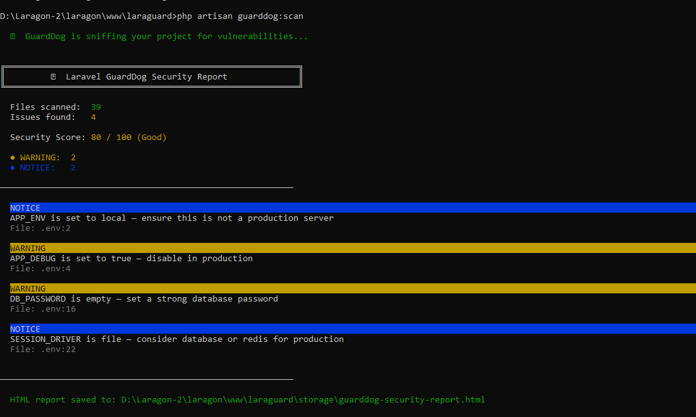
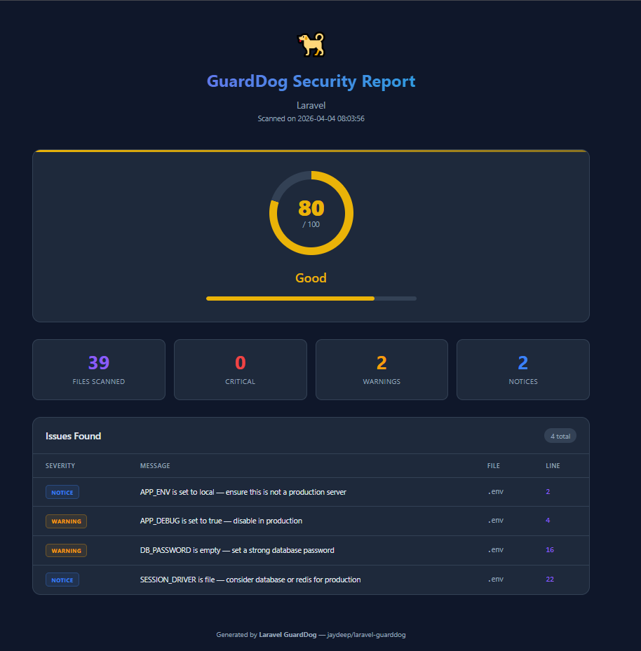

# Laravel GuardDog 🐕

[]()
[]()
[]()
[]()

**Laravel GuardDog** is a security scanner for Laravel applications that detects common vulnerabilities and generates a **beautiful HTML security report with a security score**.

GuardDog helps developers quickly identify security risks before deploying their applications.

---

# ✨ Features

* 🔎 Automatic Laravel security scanning
* 📊 Security Score (0–100)
* 🧾 Beautiful HTML report generation
* ⚡ Fast and lightweight scanning engine
* 🔐 Detects common Laravel security risks
* 🧩 Supports Laravel **8 → 13**
* 🚀 CI/CD friendly

---

## 📸 Screenshots

### Console Output



### HTML Security Report



---

# 🔍 What GuardDog Detects

Laravel GuardDog scans your project and detects:

* Raw SQL queries (possible SQL injection)
* Routes without authentication middleware
* File uploads without validation
* Missing CSRF tokens in forms
* Unsafe environment configurations

---

# 📸 Example HTML Report

GuardDog generates a clean HTML report stored inside:

`storage/guarddog-security-report.html`

Example information inside the report:

* Security score with circular progress indicator
* Total files scanned
* Total issues detected
* Detailed vulnerability list with severity badges

---

# 📦 Installation

Install via Composer:

```bash
composer require jaydeep/laravel-guarddog
```

Laravel will automatically discover the package.

---

# ⚙️ Publish Configuration (Optional)

```bash
php artisan vendor:publish --tag=guarddog-config
```

This will create `config/guarddog.php` in your project.

---

# 🚀 Usage

Run the security scanner:

```bash
php artisan guarddog:scan
```

### Command Options

| Option       | Description                        |
| ------------ | ---------------------------------- |
| `--no-html`  | Skip HTML report generation        |
| `--output=`  | Custom output path for HTML report |

### Examples

```bash
# Full scan with HTML report
php artisan guarddog:scan

# Console output only, no HTML file
php artisan guarddog:scan --no-html

# Custom report location
php artisan guarddog:scan --output=public/security-report.html
```

### Example Console Output

```
╔══════════════════════════════════════════════════════════╗
║         🐕 Laravel GuardDog Security Report              ║
╚══════════════════════════════════════════════════════════╝

  Files scanned:  142
  Issues found:   5

  Security Score: 83 / 100 (Good)

  ● CRITICAL: 1
  ● WARNING:  3
  ● NOTICE:   1

──────────────────────────────────────────────────────────

  CRITICAL
  Raw SQL with variable interpolation in DB::statement()
  File: app/Repositories/UserRepository.php:54

  WARNING
  Route without auth middleware
  File: routes/web.php:23

──────────────────────────────────────────────────────────
```

---

# 📊 Security Score System

GuardDog calculates a security score starting from **100**.

Points are deducted based on detected issues:

| Severity | Points Deducted |
| -------- | --------------- |
| Critical | -15             |
| Warning  | -7              |
| Notice   | -3              |

Score Meaning:

| Score    | Status    |
| -------- | --------- |
| 90–100   | Excellent |
| 70–89    | Good      |
| 50–69    | Risky     |
| Below 50 | Critical  |

---

# 📄 HTML Report

After running the scan, GuardDog generates a report:

`storage/guarddog-security-report.html`

The report includes:

* Security Score with circular progress bar
* Scan date
* Total files scanned
* List of vulnerabilities with file paths and line numbers
* Severity indicators

Severity colors:

* 🔴 Critical
* 🟠 Warning
* 🔵 Notice

---

# ⚙️ Configuration

Configuration file: `config/guarddog.php`

Example configuration:

```php
return [

    'scan_paths' => [
        'app/',
        'routes/',
        'resources/views/',
        'config/',
    ],

    'ignore_paths' => [
        'vendor/',
        'node_modules/',
        'storage/',
    ],

    'report_output_path' => storage_path('guarddog-security-report.html'),

];
```

---

# 🛠 Planned Features

Upcoming improvements:

* Dependency vulnerability scanner
* Automatic security fix suggestions
* GitHub Actions integration
* Historical security tracking
* Dashboard UI

---

# 🤝 Contributing

Contributions are welcome!

If you find a bug or want to add a new security scanner, feel free to open a Pull Request.

---

# 📜 License

This package is open-sourced software licensed under the MIT license.

---

# 👨‍💻 Author

Developed by **Jaydeep Gadhiya**

If you find this package useful, please consider giving it a ⭐ on GitHub.
